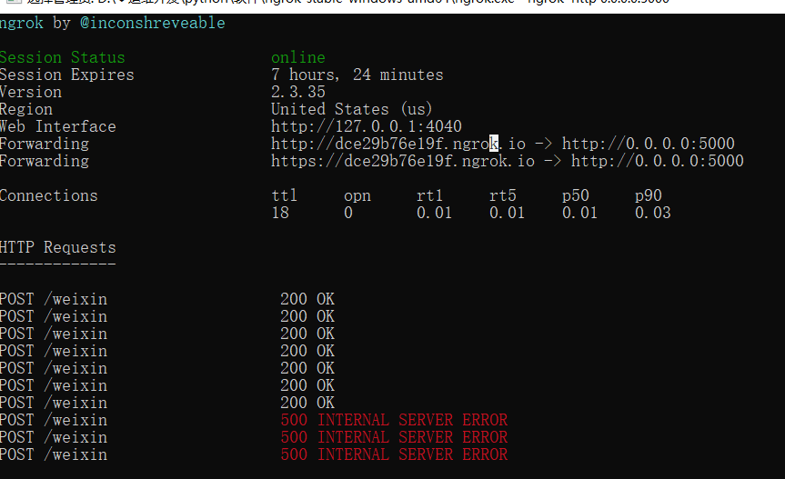
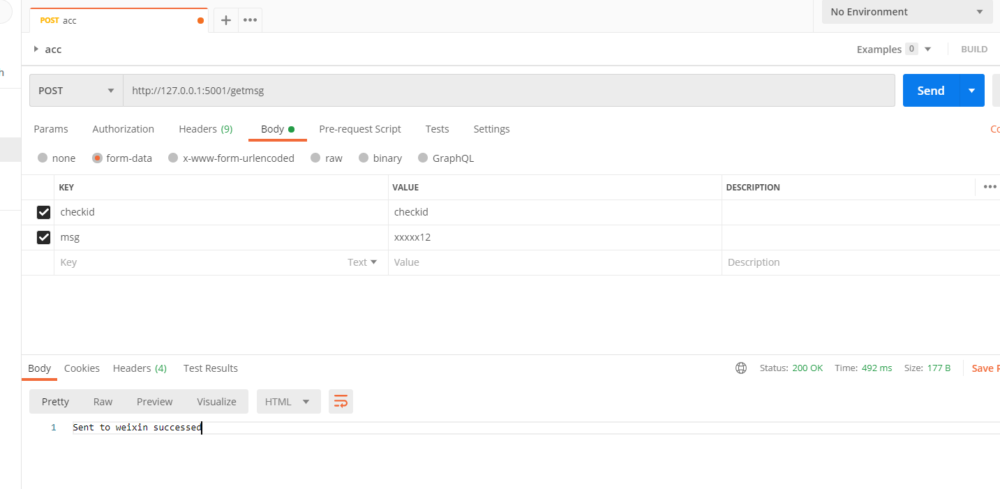

主要是企业微信发送消息以及回调，因为官方给的是python2的版本，而且因为给的代码库和范例是18年的，所有很多地方也有些坑，比如加密函数的过程中5个参数位置错位了之类的问题。
在官方给出的代码的基础上进行了更改，实现对企业微信消息发送以及回调的功能
官方地址https://github.com/sbzhu/weworkapi_python
主要更改callback文件夹中的WXBizMsgCrypt.py文件，迁移使用时将本项目中的替换即可
## callback/weixin.py
可用于回调验证。把用户在企业微信上对应的应用回复的内容记录在本地文件中。
## callback/sent_weixin.py
只接受经过校验的post数据包，并推送到企业微信上的指定应用

## 网络穿透nagrok

```css
nagrok http 0.0.0.0:5001
```

## 测试收消息



## 测试发消息




## 参考链接

[sbzhu/weworkapi_python: official lib of wework api https://work.weixin.qq.com/api/doc](https://github.com/sbzhu/weworkapi_python)

[使用pycharm导出程序所使用的的依赖包 - 想扣篮的小矮子 - 博客园](https://www.cnblogs.com/zty1304368100/p/11542257.html)

[PyCharm无法Import当前文件夹下文件的问题解决_Monkey・D・Fish-CSDN博客](https://blog.csdn.net/nofish_xp/article/details/83032605)

[python的pip命令安装request库失败、在pycharm里File>setting...>Python Interpreter里右上角点击加号搜索request点击安装也失败 - 属于自己的世界 - 博客园](https://www.cnblogs.com/will-wu/p/13523794.html)

[发送应用消息 - 企业微信API](https://work.weixin.qq.com/api/doc/90000/90135/90236)

[【Postman】5 Postman 发送post请求-form data格式（文件上传） - 知乎](https://zhuanlan.zhihu.com/p/108387853)

[企业微信告警以及回调 - 简书](https://www.jianshu.com/p/1276364e0f81)

[Python3-定时任务四种实现方式-Python编程-51CTO博客](https://blog.51cto.com/huangyg/2367088)